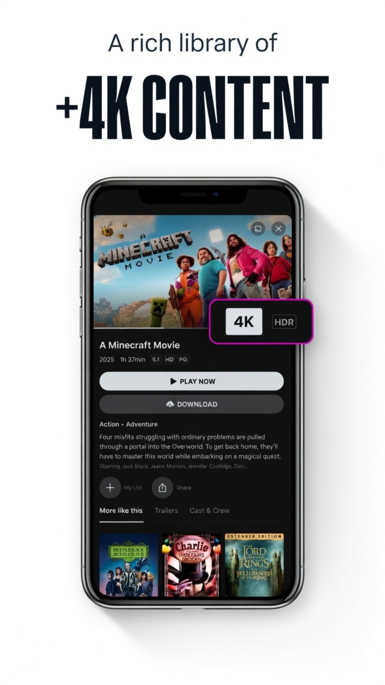

# 🎬 PluginStream Max - Ultimate Multi-Source Entertainment Hub

  

  
  
  

   
  

  

  

**PluginStream Max** is a high-performance, lightweight Android application designed to aggregate premium streaming platforms into a single interface. It uses a sophisticated **Plugin & Extension architecture** to provide ad-free access to movies, series, and live TV.

---

## 📑 Table of Contents
- [Screenshots](#-screenshots)
- [Key Features](#-key-features)
- [Download & Installation](#-download--installation)
- [Security Verification](#-security-first)
- [Performance Metrics](#-performance-metrics)
- [Contact & Support](#-contact--support)

---

## 📸 Screenshots

   
   
   
  
  

---

## 🚀 Key Features (v5.0.0 Updates)

### 1. The "Max" Powerhouse
* **Unified Library:** Merges all major streaming providers into one single, powerful section.
* **Auto-Sync:** Extensions update automatically to ensure working links 24/7.

### 2. Zero-Ad Experience
* **Built-in AdBlocker:** Advanced filtering that strips intrusive ads and trackers from 3rd-party links.
* **No Login Required:** Privacy-first approach. No account, no tracking.

### 3. Advanced Media Player
* **Dynamic Quality:** Stream from 360p to 4K resolutions.
* **Subtitle Support:** Built-in OpenSubtitles integration.
* **Chromecast:** Stream to Smart TVs seamlessly.

---

## 📥 Download & Installation

👉 **[Download PluginStream Max APK](https://pluginstream.pages.dev)**

### Quick Steps:
1. **Enable Unknown Sources** in your Android settings.
2. **Download & Install** the APK from our official site.
3. **Join Telegram** for the latest plugins and updates.

---

---
### 🛡️ Security First
This APK is verified and 100% safe to install. No malware, no trackers.

  

---

---

## 📊 Performance Metrics
| Metric | Value |
|--------|-------|
| **App Size** | ~70MB |
| **Startup Time** | <2 seconds |
| **Memory Usage** | 80-150MB |
| **Status** | Stable ✅ |

---

## 📫 Contact & Support
* **Official Website:** [pluginstream.pages.dev](https://pluginstream.pages.dev)
* **Telegram Channel:** [@pluginstreamofficial](https://t.me/pluginstreamofficial)
* **Support Group:** [PluginStream Support](https://t.me/pluginstreamsupport)
* **Developer:** Abdul Mueed

**Made with ❤️ by Abdul Mueed** | **Last Updated:** April 2026
