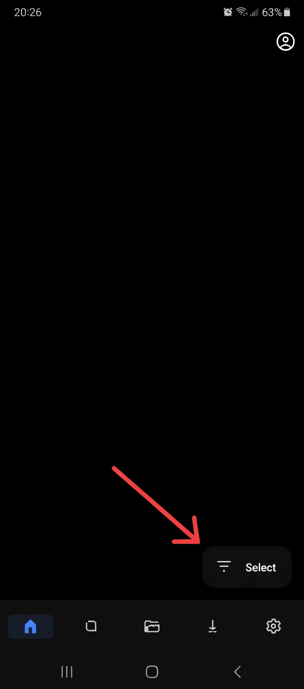
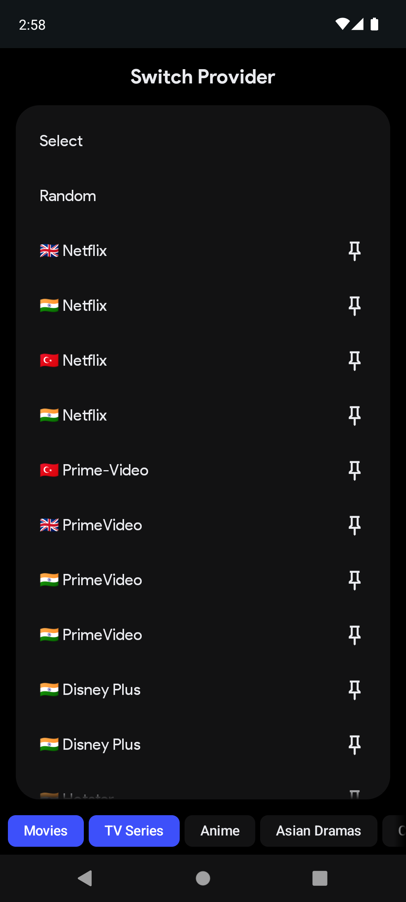
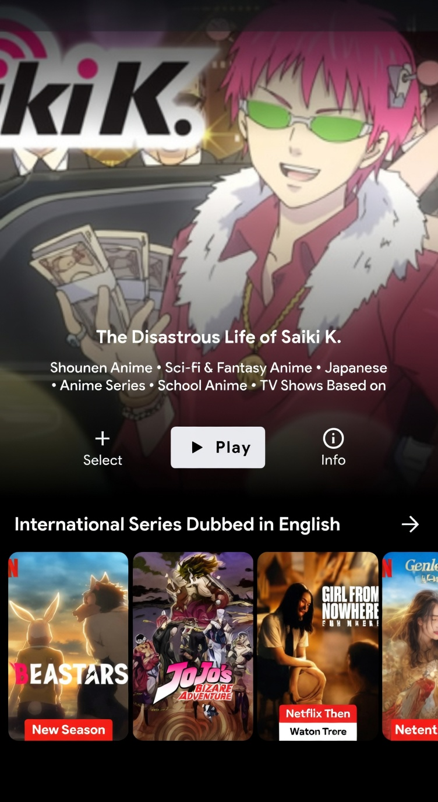
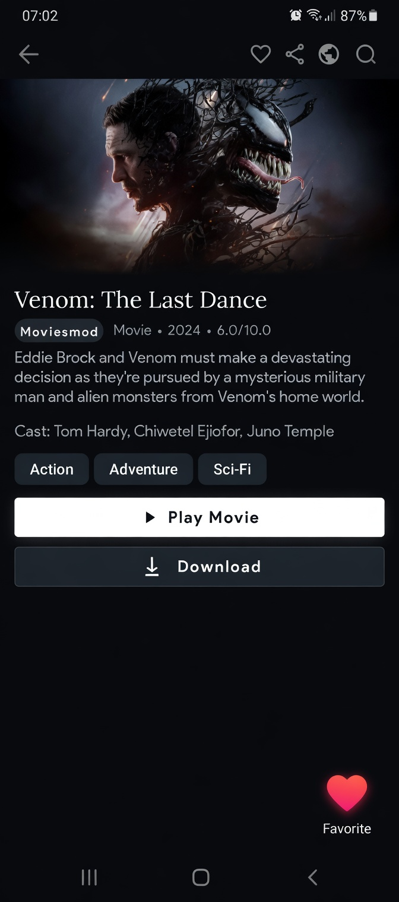
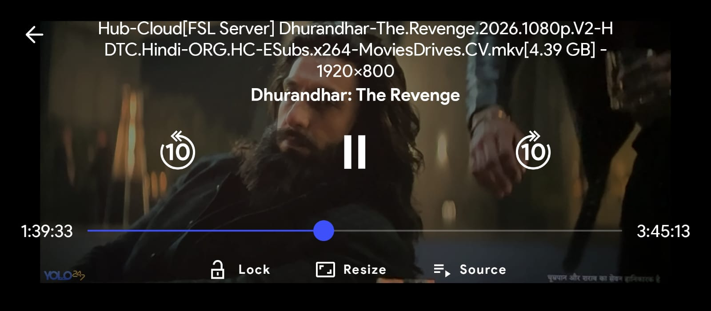

# 🎬 PluginStream - Ultimate Multi-Source Entertainment Hub

  

  
  
  

PluginStream is a high-performance, lightweight Android application designed to aggregate premium streaming platforms into a single interface. The app acts as a powerful "Shell"—it does not host any content itself but uses a sophisticated **Plugin & Extension architecture** to provide access to movies, series, and live TV from across the web.

---

## 📑 Table of Contents
- [Screenshots](#-screenshots)
- [Key Features](#-key-features)
- [Download & Installation](#-download--installation)
- [Quick Start Guide](#-quick-start-guide)
- [Configuration](#-configuration)
- [Performance Metrics](#-performance-metrics)
- [Legal Disclaimer](#-legal-disclaimer)
- [Contact & Support](#-contact--support)

---

## 📸 Screenshots

   
   
   
   
  

---

## 🚀 Key Features

### 1. Multi-Repository Support
* **Modular Architecture:** Similar to PluginStream, you can add any external repository (.json) to unlock thousands of streaming sources.
* **Auto-Sync:** Extensions update automatically in the background to ensure links remain active and working.
* **Custom Repos:** Add unlimited repositories from community developers and creators.

### 2. Global Content Reach
* **Regional Specialists:** Dedicated support for Hindi, Urdu, and English sources (Bollyflix, VegaMovies, 9kMovies, etc.).
* **Premium Mirrors:** Access mirrors for major platforms like Netflix, Disney+, and Prime Video.
* **Live Sports & IPTV:** Integrated support for IPTV playlists and live sports sources (CricHD, DaddyLive).

### 3. Advanced Media Player
* **Subtitle Integration:** Built-in OpenSubtitles support and custom local subtitle files.
* **Dynamic Quality:** Choose from 360p to 4K resolutions.
* **Offline Mode:** Download movies and episodes directly to your device.
* **Chromecast Support:** Stream to smart TVs and Cast devices seamlessly.

### 4. Zero-Ad Experience
* **Built-in AdBlocker:** Advanced filtering that strips intrusive ads and trackers from 3rd-party stream links.
* **Real-time Threat Detection:** Identifies and blocks malicious redirects.

---

## 📥 Download & Installation

### Stable Release
You can download the latest stable version (70MB) from the official distribution page:

👉 **[Download PluginStream APK](https://am-abdulmueed.vercel.app/pluginstream)**

### Installation Steps
1. **Enable Unknown Sources:** `Settings` → `Security` → `Unknown Sources`
2. **Download the APK:** From the link above.
3. **Install & Launch:** Open the file and tap `Install`.

---

## ⚙️ Configuration

### Advanced Settings
| Setting | Description | Default |
|---------|-------------|---------|
| **Auto-Update** | Enable automatic extension updates | ON |
| **Quality Preference** | Default streaming quality | 720p |
| **Cache Size** | Maximum cache storage | 2GB |

---

## 📊 Performance Metrics
| Metric | Value |
|--------|-------|
| **App Size** | ~70MB |
| **Startup Time** | <2 seconds |
| **Memory Usage** | 80-150MB |
| **Battery Impact** | ~3% per hour streaming |

---

## ⚖️ Legal Disclaimer
**PluginStream** is a functional "Aggregator" and "Parser." It does not host, store, or distribute any media files or copyrighted content. Users are solely responsible for complying with their local copyright laws.

---

## 📫 Contact & Support
* **Developer:** Abdul Mueed
* **Portfolio:** [am-abdulmueed.vercel.app](https://am-abdulmueed.vercel.app)
* **GitHub Issues:** [Report Bugs](https://github.com/am-abdulmueed/pluginstream/issues)
* **Telegram Community:** [Join Group](https://t.me/pluginstream)

**Made with ❤️ by Abdul Mueed** | **Last Updated:** March 2026
