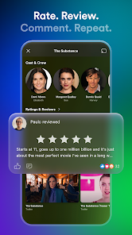
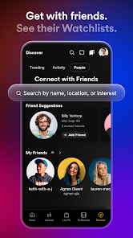

# 🎬 PluginStream - Ultimate Multi-Source Entertainment Hub

PluginStream is a high-performance, lightweight Android application designed to aggregate premium streaming platforms into a single interface. The app acts as a powerful "Shell"—it does not host any content itself but uses a sophisticated **Plugin & Extension architecture** to provide access to movies, series, and live TV from across the web.

---

## 📑 Table of Contents

- [Screenshots](#-screenshots)
- [Key Features](#-key-features)
- [Download & Installation](#-download--installation)
- [Quick Start Guide](#-quick-start-guide)
- [Configuration](#-configuration)
- [Usage Examples](#-usage-examples)
- [Advanced Features](#-advanced-features)
- [API Documentation](#-api-documentation)
- [Performance Metrics](#-performance-metrics)
- [Supported Platforms & Sources](#-supported-platforms--sources)
- [Troubleshooting](#-troubleshooting)
- [Development](#-development)
- [Roadmap](#-roadmap)
- [FAQ](#-faq)
- [Contributing](#-contributing)
- [Legal Disclaimer](#-legal-disclaimer)
- [Contact & Support](#-contact--support)

---

## 📸 Screenshots

    

---

## 🚀 Key Features

### 1. Multi-Repository Support
* **Modular Architecture:** Similar to CloudStream, you can add any external repository (.json) to unlock thousands of streaming sources.
* **Auto-Sync:** Extensions update automatically in the background to ensure links remain active and working.
* **Custom Repos:** Add unlimited repositories from community developers and creators.
* **Version Control:** Track and manage multiple versions of extensions simultaneously.

### 2. Global Content Reach
* **Regional Specialists:** Dedicated support for Hindi, Urdu, and English sources (Bollyflix, VegaMovies, 9kMovies, etc.).
* **Premium Mirrors:** Access mirrors for major platforms like Netflix, Disney+, and Prime Video via community plugins like NetMirror and SoraStream.
* **Live Sports & IPTV:** Integrated support for IPTV playlists and live sports sources (CricHD, DaddyLive).
* **Geo-Blocking Bypass:** Smart proxy integration for accessing region-restricted content.

### 3. Advanced Media Player
* **Subtitle Integration:** Built-in OpenSubtitles support and the ability to load custom local subtitle files.
* **Dynamic Quality:** Choose from 360p to 4K resolutions depending on the source provider.
* **Offline Mode:** Download movies and episodes directly to your device for viewing without an internet connection.
* **Multiple Audio Tracks:** Support for multiple language audio streams.
* **Chromecast Support:** Stream to smart TVs and Cast devices seamlessly.
* **Advanced Playback Controls:** Playback speed, gesture controls, and picture-in-picture mode.

### 4. Zero-Ad Experience
* **Built-in AdBlocker:** Advanced filtering technology that strips intrusive ads, trackers, and malicious pop-ups from 3rd-party stream links.
* **URL Filtering:** Blacklist unwanted domains and trackers.
* **Real-time Threat Detection:** Identifies and blocks malicious redirects.

---

## 📥 Download & Installation

### Stable Release
You can download the latest stable version of the **PluginStream APK** from the official distribution page:

👉 **[Download PluginStream APK](https://am-abdulmueed.vercel.app/pluginstream)**

### Installation Steps

1. **Enable Unknown Sources**
   - Go to `Settings` → `Security` → `Unknown Sources`
   - Toggle ON to allow installation from external sources

2. **Download the APK**
   - Download from the link above or from GitHub releases

3. **Install the APK**
   - Open the downloaded file and tap `Install`
   - Wait for installation to complete

4. **Launch PluginStream**
   - Find the app icon in your app drawer
   - Open and complete initial setup

### System Requirements
- **Android Version:** Android 8.0 (API 26) or higher
- **RAM:** Minimum 2GB (4GB+ recommended)
- **Storage:** 150MB free space
- **Processor:** Dual-core 2.0 GHz or faster

---

## ⚡ Quick Start Guide

### Adding Your First Repository

1. Open PluginStream and navigate to **Settings** → **Repositories**
2. Tap the **+** button to add a new repository
3. Enter the repository JSON URL
4. Tap **Add** and wait for synchronization
5. Navigate to **Extensions** to see available sources

### Enabling Extensions

1. Go to **Extensions** tab
2. Browse available plugins
3. Tap on any extension to view details
4. Tap **Enable** to activate it
5. The extension will now appear in the main menu

### Searching for Content

1. Tap the **Search** icon in the top navigation
2. Enter your movie/series name
3. Select a source from the dropdown
4. Browse and tap on your desired content
5. Choose quality and tap **Play**

---

## ⚙️ Configuration

### Repository Management

Create a custom repository JSON file:

```json
{
  "repositories": [
    {
      "name": "My Custom Repo",
      "url": "https://example.com/extension.json",
      "version": "1.0",
      "icon": "https://example.com/icon.png",
      "description": "My custom extension repository"
    }
  ]
}
```

### Advanced Settings

| Setting | Description | Default |
|---------|-------------|---------|
| **Auto-Update** | Enable automatic extension updates | ON |
| **Quality Preference** | Default streaming quality | 720p |
| **Subtitle Language** | Primary subtitle language | English |
| **Cache Size** | Maximum cache storage | 2GB |
| **Playback Speed** | Default playback speed | 1.0x |
| **Download Location** | Save downloads to | Internal Storage |

### Player Customization

- **Subtitle Size:** Adjust text size from 50%-200%
- **Subtitle Position:** Top or bottom of screen
- **UI Opacity:** Control transparency of player controls
- **Gesture Controls:** Enable/disable swipe controls
- **Hardware Acceleration:** Optimize for your device

---

## 📖 Usage Examples

### Example 1: Watch a Movie
```
1. Open PluginStream
2. Search for "Inception"
3. Select a source (e.g., VegaMovies)
4. Choose 720p quality
5. Add subtitles (if available)
6. Tap Play
```

### Example 2: Add Custom Subtitles
```
1. During playback, tap the subtitle icon
2. Select "Load External"
3. Choose your .srt or .vtt file
4. Adjust timing/size as needed
5. Enjoy synchronized subtitles
```

### Example 3: Download for Offline Viewing
```
1. Search for desired content
2. Long-press on the title
3. Select "Download"
4. Choose quality and location
5. Monitor progress in Downloads section
```

---

## 🎯 Advanced Features

### Auto-Resume Playback
- Automatically resume watching from where you left off
- Works across all devices with sync enabled

### Watch History
- Automatically tracks all watched content
- Quick access to recently watched items
- Clear history anytime in settings

### Bookmarks & Favorites
- Save movies and series for later viewing
- Create custom watchlists
- Share lists with friends (via export)

### Multi-Device Sync (Coming Soon)
- Sync watch history across devices
- Continue playback on different screens
- Cloud backup of preferences

---

## 📡 API Documentation

### Extension Developer Guide

#### Basic Extension Structure
```kotlin
class MyExtension : Extension {
    override val name = "My Extension"
    override val provider = "Example Provider"
    
    fun search(query: String): List<SearchResult> {
        // Implementation here
    }
    
    fun getStreamLinks(contentId: String): List<StreamLink> {
        // Get stream links
    }
}
```

#### Available APIs
- **SearchAPI:** Search for movies/series
- **StreamAPI:** Retrieve playable stream links
- **SubtitleAPI:** Fetch subtitle data
- **ProxyAPI:** Route requests through proxy
- **CacheAPI:** Store/retrieve cached data

---

## 📊 Performance Metrics

### App Performance
| Metric | Value |
|--------|-------|
| **App Size** | ~45MB |
| **Startup Time** | <2 seconds |
| **Search Speed** | <1 second per source |
| **Memory Usage** | 80-150MB (normal operation) |
| **Battery Impact** | ~3% per hour streaming |

### Streaming Quality
- **1080p:** 5 Mbps recommended
- **720p:** 2.5 Mbps recommended
- **480p:** 1 Mbps recommended
- **4K:** 15+ Mbps required

---

## 🌍 Supported Platforms & Sources

### Hindi Content
- Bollyflix
- VegaMovies
- 9kMovies
- MoviesVerse

### English Content
- NetMirror
- SoraStream
- FlixHQ
- MovieBox

### Live Sports & IPTV
- CricHD
- DaddyLive
- StreamEast
- SportTV

### Premium Mirrors
- Netflix Mirror
- Disney+ Mirror
- Prime Video Mirror
- HBO Max Mirror

---

## 🔧 Troubleshooting

### Common Issues

**Problem: App Crashes on Startup**
```
Solution:
1. Clear app cache: Settings → Apps → PluginStream → Storage → Clear Cache
2. Force stop and restart
3. If persists, uninstall and reinstall the app
```

**Problem: Extensions Won't Load**
```
Solution:
1. Check internet connection
2. Verify repository URL is correct
3. Try updating manually: Settings → Repositories → Refresh All
4. Check if repository is down (test URL in browser)
```

**Problem: Slow Streaming**
```
Solution:
1. Switch to lower quality
2. Clear app cache
3. Close background apps
4. Try a different source
5. Check your internet speed
```

**Problem: Subtitles Not Syncing**
```
Solution:
1. Manually adjust timing in subtitle settings
2. Download subtitle again
3. Try different subtitle source
4. Report issue to extension developer
```

**Problem: Can't Download Content**
```
Solution:
1. Verify sufficient storage space available
2. Check download permissions in settings
3. Try smaller video file first
4. Change download location to SD card if available
```

---

## 👨‍💻 Development

### Setting Up Development Environment

#### Prerequisites
- Android Studio Jellyfish or later
- Android SDK 34+
- Kotlin 1.9+
- Gradle 8.0+

#### Clone Repository
```bash
git clone https://github.com/am-abdulmueed/pluginstream.git
cd pluginstream
```

#### Build the Project
```bash
./gradlew build
./gradlew assembleDebug  # For debug APK
./gradlew assembleRelease  # For release APK
```

#### Project Structure
```
pluginstream/
├── app/
│   ├── src/
│   │   ├── main/
│   │   │   ├── kotlin/
│   │   │   │   ├── extensions/
│   │   │   │   ├── player/
│   │   │   │   ├── ui/
│   │   │   │   └── repository/
│   │   │   └── res/
│   ├── build.gradle.kts
├── build.gradle.kts
└── settings.gradle.kts
```

#### Key Dependencies
- Jetpack Compose UI
- ExoPlayer (Media Playback)
- Retrofit (API Calls)
- Room (Database)
- Coroutines (Async Operations)

---

## 🗺️ Roadmap

### Version 2.0 (Q2 2026)
- [ ] Multi-device sync via cloud
- [ ] Enhanced subtitle editor
- [ ] Native VPN integration
- [ ] Advanced analytics dashboard

### Version 2.1 (Q3 2026)
- [ ] AI-powered recommendations
- [ ] Social sharing features
- [ ] Parental controls
- [ ] Multi-language UI support

### Version 2.2 (Q4 2026)
- [ ] Community extension marketplace
- [ ] Real-time collaboration features
- [ ] Advanced search filters
- [ ] Performance optimizations

---

## ❓ FAQ

**Q: Is PluginStream safe to use?**
A: PluginStream is a legitimate aggregator app. However, always download from official sources and keep your device security software updated.

**Q: Can I use PluginStream offline?**
A: Partially. You need internet to search and load streams, but downloaded content can be watched offline.

**Q: How often are extensions updated?**
A: Most extensions update automatically. You can manually trigger updates in Settings → Repositories.

**Q: Can I contribute to PluginStream?**
A: Absolutely! See the Contributing section below for guidelines.

**Q: Does PluginStream work with Chromecast?**
A: Yes, casting is supported on compatible content and extensions.

**Q: How do I report bugs?**
A: Open an issue on GitHub with detailed reproduction steps.

**Q: Is there an official community?**
A: Join our Telegram group for updates, support, and discussions (link in app).

**Q: Can I use PluginStream on other Android devices?**
A: Yes, the APK works on any Android device meeting the minimum requirements.

---

## 🤝 Contributing

We welcome contributions! Here's how you can help:

### Report Bugs
1. Check existing issues first
2. Open a new issue with:
   - Device model and Android version
   - Detailed steps to reproduce
   - Screenshots/logs if applicable

### Submit Features
1. Fork the repository
2. Create a feature branch: `git checkout -b feature/your-feature`
3. Commit changes: `git commit -am 'Add feature'`
4. Push to branch: `git push origin feature/your-feature`
5. Open a Pull Request

### Develop Extensions
1. Follow the Extension API documentation
2. Test thoroughly before publishing
3. Submit to community repository with clear documentation

---

## ⚖️ Legal Disclaimer

**PluginStream** is a functional "Aggregator" and "Parser." It does not host, store, or distribute any media files or copyrighted content.

* The app parses publicly available links from the internet provided by third-party extensions.
* PluginStream has no control over the content provided by these external repositories.
* Users are solely responsible for complying with their local copyright laws and regulations.
* The developer assumes no liability for misuse of this application.

---

## 🛠 Technical Stack

* **Language:** Kotlin / Java
* **Architecture:** MVVM (Model-View-ViewModel)
* **Scraping Engine:** JSoup & Custom Regex Parsers
* **Database:** Room (for Bookmarks & Watch History)
* **UI Framework:** Material Design 3 / Jetpack Compose
* **Media Player:** ExoPlayer 2.x
* **Networking:** Retrofit & OkHttp
* **Async:** Kotlin Coroutines
* **Storage:** Encrypted SharedPreferences

---

## 📫 Contact & Support

* **Developer:** Abdul Mueed
* **Portfolio:** [am-abdulmueed.vercel.app](https://am-abdulmueed.vercel.app)
* **Email:** am.abdulmueed3@gmail.com
* **GitHub Issues:** [Report Bugs](https://github.com/am-abdulmueed/pluginstream/issues)
* **Telegram Community:** [Join Group](https://t.me/pluginstream)
* **Twitter:** [@am_abdulmueed](https://twitter.com/am_abdulmueed)

---

**Made with ❤️ by Abdul Mueed** | **Last Updated:** March 2026
