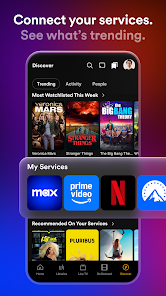
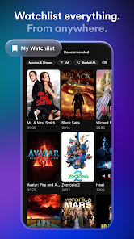

# 🎬 PluginStream - Ultimate Multi-Source Entertainment Hub

PluginStream is a high-performance, lightweight Android application designed to aggregate premium streaming platforms into a single interface. The app acts as a powerful "Shell"—it does not host any content itself but uses a sophisticated **Plugin & Extension architecture** to provide access to movies, series, and live TV from across the web.

---

## 📸 Screenshots

| Home Feed | Provider List | Player UI |
| :---: | :---: | :---: |
|   |  |  |

---

## 🚀 Key Features

### 1. Multi-Repository Support
* **Modular Architecture:** Similar to CloudStream, you can add any external repository (.json) to unlock thousands of streaming sources.
* **Auto-Sync:** Extensions update automatically in the background to ensure links remain active and working.

### 2. Global Content Reach
* **Regional Specialists:** Dedicated support for Hindi, Urdu, and English sources (Bollyflix, VegaMovies, 9kMovies, etc.).
* **Premium Mirrors:** Access mirrors for major platforms like Netflix, Disney+, and Prime Video via community plugins like NetMirror and SoraStream.
* **Live Sports & IPTV:** Integrated support for IPTV playlists and live sports sources (CricHD, DaddyLive).

### 3. Advanced Media Player
* **Subtitle Integration:** Built-in OpenSubtitles support and the ability to load custom local subtitle files.
* **Dynamic Quality:** Choose from 360p to 4K resolutions depending on the source provider.
* **Offline Mode:** Download movies and episodes directly to your device for viewing without an internet connection.

### 4. Zero-Ad Experience
* **Built-in AdBlocker:** Advanced filtering technology that strips intrusive ads, trackers, and malicious pop-ups from 3rd-party stream links.

---

## 📥 Download & Installation

You can download the latest stable version of the **PluginStream APK** from the official distribution page:

👉 **[Download PluginStream APK](https://am-abdulmueed.vercel.app/pluginstream)**

---

## ⚖️ Legal Disclaimer
**PluginStream** is a functional "Aggregator" and "Parser." It does not host, store, or distribute any media files or copyrighted content. 
* The app parses publicly available links from the internet provided by third-party extensions.
* PluginStream has no control over the content provided by these external repositories.
* Users are solely responsible for complying with their local copyright laws and regulations.

---

## 🛠 Technical Stack
* **Language:** Kotlin / Java
* **Architecture:** MVVM (Model-View-ViewModel)
* **Scraping Engine:** JSoup & Custom Regex Parsers
* **Database:** Room (for Bookmarks & Watch History)
* **UI Framework:** Material Design 3 / Jetpack Compose

---

## 📫 Contact & Support
* **Developer:** Abdul Mueed
* **Portfolio:** [am-abdulmueed.vercel.app](https://am-abdulmueed.vercel.app)
* **Email:** am.abdulmueed3@gmail.com
